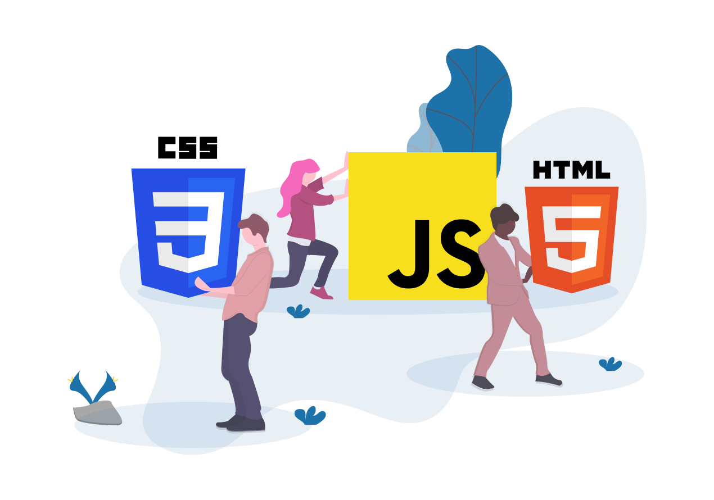

### Pseudo-Code

Sebelum menginjakkan kaki ke bahasa programan, ada baiknya kita mengetahui tentang kode-palsu atau lebih akrab disebut pseudo-code.

Pseudo-code memungkinkan perancang untuk fokus pada logika dari algoritma tanpa terganggu dengan rincian sintaksis bahasa pemrograman.
Pseudo-code biasanya digunakan ketika merencanakan implementasi suatu algoritma yang bersifat spesifik, utamanya algoritma yang masih belum begitu dikenalinya.

Pseudo-code menggunakan bahasa umum, namun saat ini hampir mendekati struktur bahasa pemrograman kebanyakan. Contoh penulisan pseudo-code sebagai berikut:

```
<variabel> = <nilai>
jika <kondisi>
    lakukan sesuatu
lain
    lakukan yang lain
ketika <kondisi>
    Lakukan sesuatu
untuk <variabel> dari <awal> ke <akhir> dengan <langkah>
    lakukan dengan variabel
fungsi <nama_fungsi>(<argumen>)
    lakukan sesuatu dengan argumen
    hasilkan sesuatu
<variabel> = <nama_fungsi>(<argumen>) //Pemanggilan fungsi dengan hasil ke variabel
Atau
<nama_fungsi>(<argumen>) //Pemanggilan fungsi
```

### JavaScript

JavaScript adalah bahasa pemrograman tingkat tinggi dan dinamis. Javacript adalah bahasa pemrograman yang pada awalnya untuk pengembangan web atau _web development_. Namun seiring dengan berkembangnya zaman JavaScript juga bisa digunakan untuk pengembangan aplikasi mobile atau _mobile development_ . JavaScript umumnya sudah tersedia pada web browser seperti `Google` , `Chrome` ,`Mozilla Firefox` dan sebagainya

### Sejarah Javascript 

JavaScript pertama kali dikembangkan oleh Brendan Eich dari Netscape di bawah nama Mocha, yang nantinya namanya diganti menjadi LiveScript, dan akhirnya menjadi JavaScript.

Kelemahan pemrosesan di sisi web server adalah, setiap instruksi dari user harus dikirim terlebih dahulu kepada web server, baru kemudian ditampilkan lagi di dalam web browser. Karena kecepatan rata-rata koneksi internet yang terbatas, hal ini dipandang tidak efisien. Programmer web membutuhkan bahasa pemograman client-side yang bisa berjalan di web browser tanpa harus dikirim ke server.

Pada tahun 1995, Brendan Eich seorang programmer dari Netscape mulai mengembangkan sebuah bahasa pemograman script yang dinamakan Mocha. Netscape pada saat itu merupakan perusahaan software ternama yang memiliki web broser Netscape Navigator.

Bahasa script Mocha ini ditujukan untuk client-side dan juga server-side. Dalam perkembangan selanjutnya, nama Mocha diubah menjadi LiveScript untuk versi client-side, dan LiveWire untuk versi server-side. Pada saat bahasa pemograman tersebut akan dirilis, Netscape mengadakan kerjasama dengan Sun Microsystems untuk mengembangkan LiveScript, dan tepat ketika Netscape Navigator 2 dirilis, Netscape merubah nama LiveScript menjadi JavaScript dengan tujuan bahasa baru ini akan populer seperti bahasa Java yang saat itu sedang booming di kalangan programmer. Versi JavaScript ini dinamakan dengan JavaScript 1.0.

Navigator sebelumnya telah mendukung Java untuk lebih bisa dimanfaatkan para pemrogram yang non-Java.Maka dikembangkanlah bahasa pemrograman bernama LiveScript untuk mengakomodasi hal tersebut.Bahasa pemrograman inilah yang akhirnya berkembang dan diberi nama JavaScript, walaupun tidak ada hubungan bahasa antara Java dengan JavaScript.

JavaScript bisa digunakan untuk banyak tujuan, misalnya untuk membuat efek rollover baik di gambar maupun teks, dan yang penting juga adalah untuk membuat AJAX. JavaScript adalah bahasa yang digunakan untuk AJAX.

### Berkas JavaScript

Berkas JavaScript dinamai dengan akhiran ektensi _.js_ . Kode JavaScript dimasukan kedalam kode `HTML` dengan tag `<script></script>`

```html
<!DOCTYPE html>
<html>
  <head>
    <meta charset="utf-8" />
    <title>Belajar JS</title>
  </head>
  <body>
    <script>
      document.write("Halo Dunia!")
    </script>
  </body>
</html>
)
```

Kata kunci ( _keyword_ ) `document.write()` digunakan untuk mengeluarkan tampilan (mencetak), dalam kode ini mencetak teks `Halo dunia!`.

### Penulisan Kode JavaScript

Ada dua cara penulisan kode javaScript

1. Memasukan kode secara langsung pada file HTML

2) Memisahkan kode HTML dengan JavaScript

Contoh memasukan kode secara langsung pada file HTML

```html
<!--index.html-->
<!DOCTYPE html>
<html>
  <head>
    <meta charset="utf-8" />
    <title>Belajar JS</title>
  </head>
  <body>
    <script>
      document.write("Halo Dunia!")
    </script>
  </body>
</html>
```

contoh memisahkan kode HTML dengan JavaScript

```html
<!--index.html-->
<!DOCTYPE html>
<html>
  <head>
    <meta charset="utf-8" />
    <title>Belajar JS</title>
  </head>
  <body>
    <script src="halo.js"></script>
  </body>
</html>
```

```javascript
//halo.js
document.write("Halo Dunia!")
```
